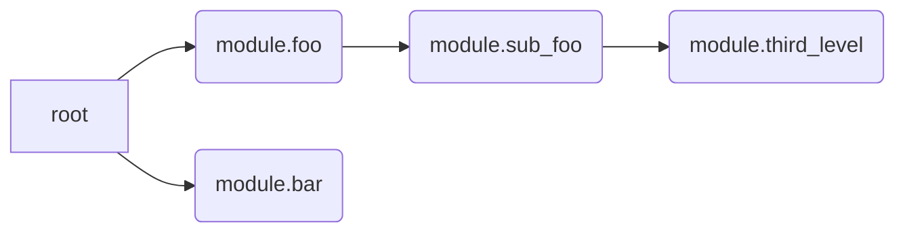
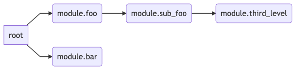

# TF State

Quick and simple demonstration how to visualize modules within state.

Simply pipe the state to the application and it will output for the purpose of this demo mermaid.js formatted output.

Using the sample terraform code in the repo.

```
cat terraform/terraform.tfstate | go run main.go
```

Graph output


Visualized with mermaid.js [live editor](https://mermaid-js.github.io/mermaid-live-editor/#)

